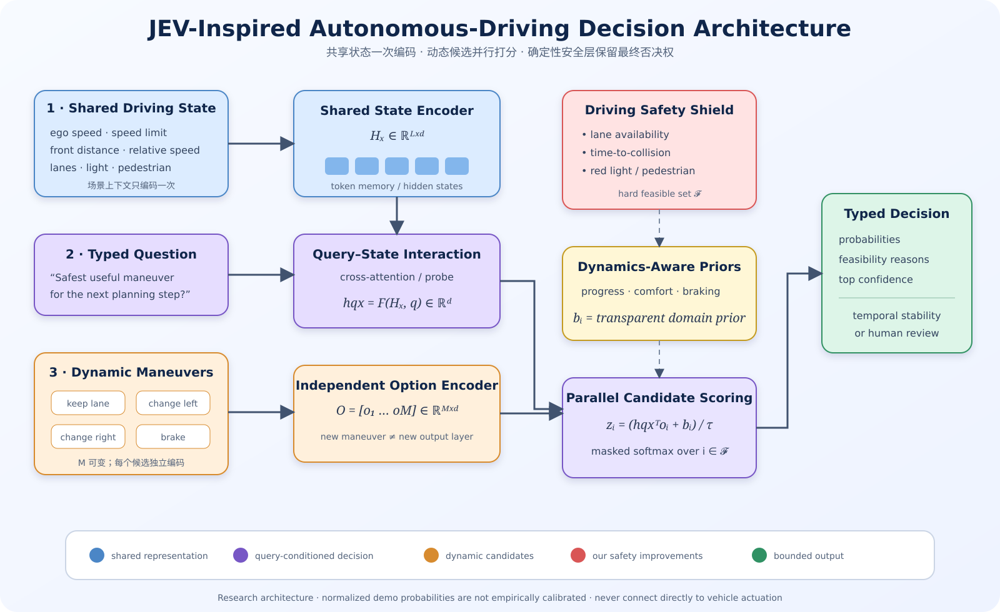

# JEV Architecture for Autonomous Driving

> A clean-room, executable **JEV-inspired decision architecture** for autonomous-driving research: encode shared scene state once, build a question-conditioned decision embedding, score independently encoded candidate actions in parallel, and return a normalized probability distribution.

[中文说明](#中文说明) · [Architecture](docs/ARCHITECTURE.md) · [Safety](SECURITY.md)



## What this project is

This repository turns a public architectural hypothesis about JEV into a small, testable reference implementation. The observable JEV product contract supports typed choices and probability distributions, but TypeSafe AI has not published its internal network architecture. Therefore, this is an independent implementation—not official JEV code and not a claim about undisclosed internals.

The core computation is:

```text
scene state ──► shared state encoder ──► Hx
question ──────────────────────────────► q
                     cross-attention(Hx, q) ──► hqx
candidate actions ──► independent embeddings O=[o1...oM]
                     zi = hqxᵀoi + domain_prior_i
                     masked softmax(z) ──► action probabilities
```

The diagram separates the reusable JEV-style candidate-ranking core from the driving-specific contribution. Blue and purple blocks create one decision representation from the shared scene and typed question. Orange blocks allow the maneuver set to change at runtime. Red and yellow blocks are our deterministic safety and dynamics additions; they modify or remove candidates before the final normalized decision.

## Driving-specific improvements

This implementation adds four layers that a generic option scorer does not provide:

1. **Safety shield** — invalid actions are removed before softmax using time-to-collision, lane availability, traffic-light and pedestrian constraints.
2. **Dynamics-aware priors** — progress, comfort and lane-change costs are combined with semantic scores.
3. **Temporal stability** — a switch margin prevents action oscillation when two choices have nearly equal scores.
4. **Explicit abstention** — low-confidence situations return `request_human_review` instead of silently choosing a risky maneuver.

These layers illustrate a useful separation: learned or semantic ranking proposes; deterministic code enforces safety constraints.

The included offline model has not been empirically calibrated. Its softmax values are useful for exercising the architecture and gates, not as real-world likelihood estimates.

## Quick start

Python 3.10+ is sufficient; there are no third-party runtime dependencies.

```bash
python -m jev_driving.cli examples/highway_merge.json
python -m unittest discover -s tests -v
```

Example output:

```text
decision: keep_lane
confidence: 0.731...
safe: true
```

## Python API

```python
from jev_driving import DrivingDecisionEngine, DrivingState

engine = DrivingDecisionEngine()
result = engine.decide(
    DrivingState(
        ego_speed_mps=18.0,
        speed_limit_mps=22.0,
        front_distance_m=32.0,
        front_relative_speed_mps=-1.0,
        left_lane_available=True,
        right_lane_available=False,
        pedestrian_distance_m=None,
        traffic_light="green",
    ),
    question="What is the safest useful maneuver for the next planning step?",
    candidates=["keep lane", "change left", "change right", "brake"],
)
print(result.choice, result.probabilities)
```

## Repository boundaries

- All code and examples here were created from scratch as a public reference implementation.
- No proprietary autonomous-driving source code, vehicle logs, maps, model weights, configuration, or company data are included.
- The examples are synthetic and must not be used to control a real vehicle.

## 中文说明

这是一个从零编写、可运行的 **JEV 风格自动驾驶决策架构**。它按照“共享场景只编码一次、问题与场景交互生成决策向量、候选动作独立编码、一次并行打分”的思路实现，并针对自动驾驶增加：硬安全约束、动力学与舒适性先验、时序防抖和低置信度拒绝机制。

图中蓝色模块是共享场景表示，紫色模块根据问题生成决策向量，橙色模块负责动态候选动作；红色安全屏蔽和黄色动力学先验是自动驾驶方向的改进。只有通过车道、碰撞时间、红灯和行人约束的动作才进入 softmax，最后再经过时序稳定和低置信度拒绝，输出有限、可解释的动作选择。

JEV 的底层网络结构目前并未公开，因此本项目明确定位为独立的架构提案和研究实现，而不是 TypeSafe AI 的官方实现。项目不包含任何公司代码、内部数据或真实车辆资料。

## Responsible use

This is an educational simulator, not a production driving stack. Do not connect it to actuation, road vehicles, or safety-critical systems. See [SECURITY.md](SECURITY.md).

## References

- [TypeSafe AI — System One Models and JEV](https://typesafe.ai/)
- [Introducing System One Models & JEV](https://typesafe.ai/blog/introducing-system-one-models-and-jev)

These sources describe JEV's public behavior and training goals, not the undisclosed internal layer design implemented as a hypothesis here.

## License

MIT. See [LICENSE](LICENSE).
