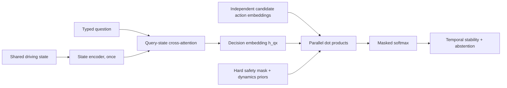

# Architecture

## Status of the claim

This repository implements a falsifiable architecture hypothesis, not leaked or reverse-engineered proprietary internals. Public descriptions establish typed questions, bounded choices, parallel output and probability distributions; they do not establish the exact hidden layers used by the hosted JEV model.

## Reference pipeline

For candidate \(i\), the generic head computes

\[
z_i = h_{qx}^{\mathsf T}o_i + b_i, \qquad
p_i = \frac{\exp(z_i / \tau)}{\sum_{j \in \mathcal{F}} \exp(z_j / \tau)}
\]

where \(\mathcal{F}\) is the set allowed by the safety shield and \(b_i\) is a transparent domain prior.

## Step-by-step explanation / 分步解释

1. **Shared driving state / 共享驾驶状态** — speed, headway, relative speed, lane availability, traffic signal and pedestrian distance form one reusable context. It is encoded once into token memory \(H_x\), instead of repeating the long scene for every maneuver.
2. **Typed question / 类型化问题** — the question describes the current decision objective. Query–state attention selects the parts of \(H_x\) relevant to that objective and produces \(h_{qx}\).
3. **Dynamic maneuvers / 动态候选动作** — each maneuver is encoded independently as \(o_i\). Adding a candidate changes \(M\), not the network output dimension.
4. **Safety shield / 安全屏蔽** — deterministic rules construct feasible set \(\mathcal{F}\). An unavailable lane, urgent collision risk, red light or nearby pedestrian gives an invalid action exactly zero probability.
5. **Dynamics-aware prior / 动力学先验** — explicit terms \(b_i\) represent progress, comfort and braking preference. They are inspectable and can be tuned independently of the semantic encoder.
6. **Parallel scoring / 并行打分** — all feasible candidates use the same dot-product head. Masked softmax normalizes only over \(\mathcal{F}\).
7. **Temporal and uncertainty gate / 时序与不确定性门控** — a switch margin reduces action oscillation. If the best probability is below the configured threshold, the engine returns `request_human_review`.

The diagram deliberately places the safety shield outside the learned representation path: model preference can rank safe maneuvers, but it cannot restore a maneuver rejected by a hard constraint.

## Why this is useful for driving

The expensive scene representation is shared. The number of candidate maneuvers can change without changing the output layer. New candidates can be described in natural language, independently embedded and scored in the same pass. Hard constraints remain outside the semantic model so an attractive but invalid action cannot regain probability through learned scoring.

## Deliberate simplifications

The included hash encoder is deterministic infrastructure for demonstrating data flow. It is not a trained driving model. Replace it with a validated text/state encoder and learn the interaction head on public or properly licensed data before conducting research comparisons.
